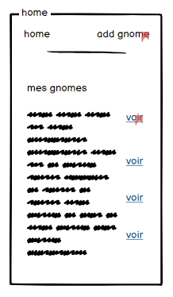
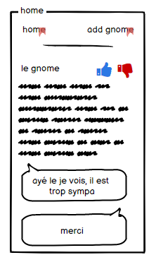
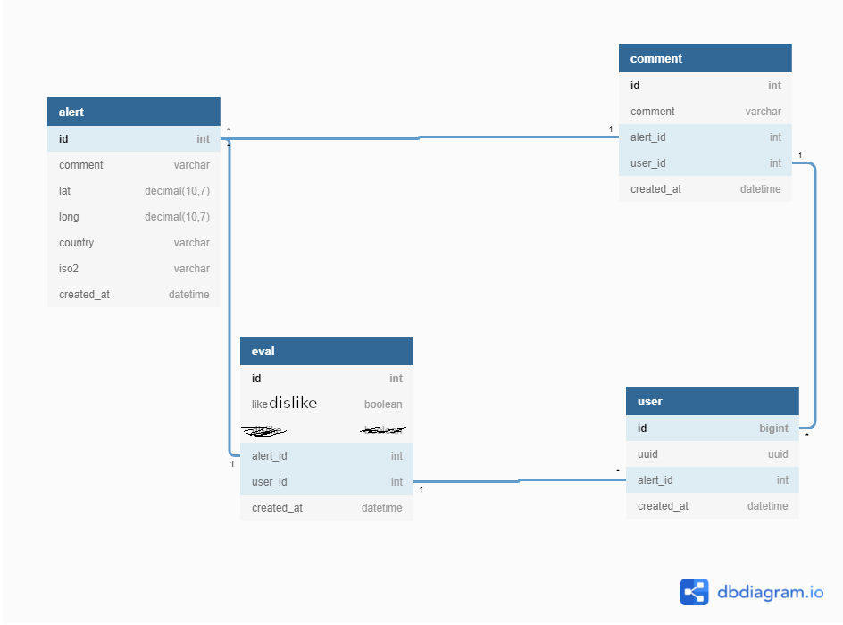

# gnomebot

## quick install

se placer sous /gnomebot
executer: 
    docker-compose up
    ou
    ./start.sh

## Usage

###  je signal un gnome

list gname | form | retour 
--| -- | --
 |  | 
je clique sur add | j'ajoute un commentaire | je reviens sur la liste

###  je peux apprecier une geololisation : par exemple : si un gnome n'est plus la, je click un bouton j'aime pas

## schema

