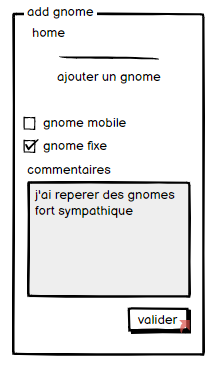

# gnomebot

## quick install

se placer sous /gnomebot
executer: 
    docker-compose up
    ou
    ./start.sh

ou

```
sudo apt install php7
php -S localhost:8080 -t src
```


## Usage

###  je signal un gnome

(1) liste gnome | (2) form | (3) retour 
--| -- | --
 |  | 
je clique sur voir | un form apparait, j'ajoute un commentaire si besoin | je reviens sur la liste


le systeme doit purger les alert obsoletes ( date, distance, appreciation )

example : 

- supprimer les alert de plus de 30 min
- trier les alert en dessous de 5 km
- virer les alertes qui ont un avis negatif 

###  je peux apprecier une geololisation : par exemple : si un gnome n'est plus la, je click un bouton j'aime pas


## schema


## ressource

https://pwa-starter-kit.polymer-project.org/application-testing
